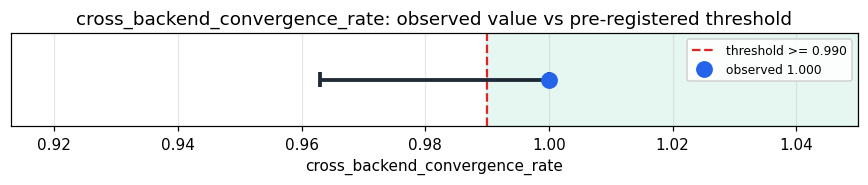

# Empirical Proof Record — **VALIDATED**

**Proof ID:** `6e6ce4a0b4e0fe9d4681b62564fa4a1cdc0bd95a427a3249cc521b7c23fb78ae`  
**Created:** 2026-05-24T03:29:05.052661+00:00

## 1. Claim

> Across 100 randomized op sequences (20 insert ops each), the two Yjs Python backends (pycrdt, y-py) converge to identical final text in ≥ 99.0% of cases. Both wrappers bind to the same Yrs Rust core; disagreement is a real bug. (CLAUDE.md §Layer 4 CRDT reconciliation: Kimera's distributed-substrate fusion relies on this law holding for the underlying CRDTs.)

- **Operationalisation:** For each of N sequences (deterministic seed), generate K insert ops with random (position, char) pairs. Apply each sequence to both backends; record (a) whether final text agrees, (b) per-backend wall-time. Aggregate the agreement rate; Wilson 95% CI on the binomial proportion.
- **Threshold:** `cross_backend_convergence_rate >= 0.99 proportion`
- **H0:** cross_backend_convergence_rate < 0.99 (at least one backend disagrees on final state in > 1.0% of cases)
- **H1:** cross_backend_convergence_rate >= 0.99 (both Yjs Python wrappers — pycrdt + y_py — converge to identical final text on the vast majority of randomized op sequences, as the shared Yrs Rust core requires)

## 2. Verdict

**Outcome:** VALIDATED  
**Observed:** `1.0`

100/100 sequences converged across both backends (1.0000); Wilson 95% CI [0.9630, 1.0000]

## 3. Pre-registration

- Registered at: `2026-05-24T03:29:04.819198+00:00`
- Config hash: `eef18a4bba44d947a0033d81f07e75bf238d3bbc90dc8094d3525624ba140d75`
- Data hash: `eef18a4bba44d947a0033d81f07e75bf238d3bbc90dc8094d3525624ba140d75`

_Generate 100 random insert-op sequences (20 ops each, seed=20260515); apply each to a pycrdt YDoc AND a y-py YDoc; assert final text agrees. Wilson 95% CI on the binomial agreement rate; verdict against the pre-registered ≥99.0% threshold._

## 4. Data

- Substrate: `pycrdt+y_py-cross-backend` @ ``
- Dataset: `synthetic-crdt-op-sequences` (synthetic-crdt-op-stream, 100 records, hash `eef18a4bba44…`)

## 5. Evidence

| pillar | statistic | value | 95% CI | library |
|---|---|---|---|---|
| `cross_backend_yjs_convergence` | `cross_backend_convergence_rate` | `1.0` | (0.9630, 1.0000) | statsmodels 0.14.6 |

## 6. Signature

`0d606bb5d0fc7abce306f97b8cb7896b1613c3acb309781274b95ee279c8ba5b`
