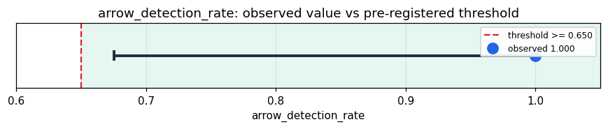

# Empirical Proof Record — **VALIDATED**

**Proof ID:** `fae2098bf5faad4b1d9371434996a3ffaa5c7f601ef85af93a77227b4a57f86a`  
**Created:** 2026-05-23T23:16:46.630205+00:00

## 1. Claim

> Across 8 real FRED series, the substrate recovers the true temporal direction (vs the exact reversal) at rate ≥ 65% via a consistent path-dependent irreversibility signature. An order-blind reader is 0.5 by construction (identical value multiset).

- **Operationalisation:** For each series, take the last 48 values (z-scored); stream them FORWARD and REVERSED through the 'entity' target as bare-number stimuli (no direction words). For each path-dependent numeric observable in CycleResult.raw, compute a per-direction summary; the substrate 'votes' forward = the direction with the larger summary. arrow_detection_rate = sign-consistency of that vote vs the true arrow, max over observables (sign-agnostic: a flipped but consistent vote still counts as detection).
- **Threshold:** `arrow_detection_rate >= 0.65 proportion`
- **H0:** H0: rate ≈ 0.5 — the substrate is arrow-blind through the numeric channel (no consistent forward/reversed asymmetry)
- **H1:** H1: rate ≥ 65% — the substrate feels the arrow of time via its path-dependent entropy production

## 2. Verdict

**Outcome:** VALIDATED  
**Observed:** `1.0`

arrow-detection rate 1.000 on 8 real series (best observable: thermo_bridge_state.layer1.dominant_signature.unknown::cum_end); order-blind baseline = 0.500 by construction; Wilson 95% CI [0.676, 1.000]

## 3. Pre-registration

- Registered at: `2026-05-23T23:16:46.399267+00:00`
- Config hash: `890acd0a378abdf02e5e9878d430bb2b8bd5f0259388d4c01e26255c13ce9b52`
- Data hash: `0fce9b79cbca7980faeb297bc3f6d3ac81626a968e7bb138cd0623f7e562cae7`

_Stream 8 real FRED series (last 48 z-scored values) forward and reversed; per path-dependent observable compute forward-vs-reversed asymmetry; arrow_detection_rate = best sign-consistent vote vs the true arrow; decide against >= 65% (chance 0.5); Wilson 95% CI._

## 4. Data

- Substrate: `kimera-swm` @ `78cb9f9fc6a8`
- Dataset: `fred-arrow-of-time` (real-macro-time-series (forward vs exact reversal), 8 records, hash `0fce9b79cbca…`)

## 5. Evidence

| pillar | statistic | value | 95% CI | library |
|---|---|---|---|---|
| `path_dependent_irreversibility` | `arrow_detection_rate` | `1.0` | (0.6756, 1.0000) | statsmodels 0.14.6 |

## 6. Signature

`58c23b94d3ccc3941066080c0c4b2ce077298b68566ba0c61e7a4bc7eed7beeb`
