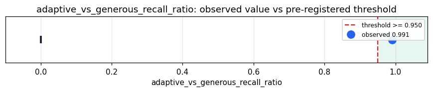

# Empirical Proof Record — **VALIDATED**

**Proof ID:** `1fd389f54f7333097d6b3c69a551cbb212f8d5a12b913834828d480b5d08a497`  
**Created:** 2026-05-24T17:18:27.982680+00:00

## 1. Claim

> As a real concept cloud grows (40→200 words), the substrate's self-determined geoid dimension N=round(IPR) tracks the cloud (N grows, non-decreasing) and stays within 5% of the recall@5 achievable at a generous fixed dimension at every growth stage — meaning finds its own near-optimal dimension, no number chosen by anyone.

- **Operationalisation:** At each cumulative stage, re-fit LearnedManifoldProjector(accumulated_cloud, target_dim=None) → N=round(IPR); leave-one-out recall@5 (full-BGE kin) on the projected positions vs the same at a generous fixed N=min(stage_size-1,128); min over stages of the ratio, gated on N growing.
- **Threshold:** `adaptive_vs_generous_recall_ratio >= 0.95 ratio`
- **H0:** H0: ratio < 0.95 or N does not grow — the self-found dimension is not near-optimal/tracking
- **H1:** H1: ratio >= 0.95 and N grows — meaning finds its own near-optimal dimension

## 2. Verdict

**Outcome:** VALIDATED  
**Observed:** `0.9913388291766669`

N trajectory [29, 50, 68, 81, 89] (grew=True, IPR-tracked); min(adaptive/generous recall@5)=0.9913 over 5 growth stages; adaptive beats the live fixed-5 default by min +0.225; the self-found dimension is near the generous-N ceiling at every stage while using 29 dims at 40 concepts vs 39 generous.

## 3. Pre-registration

- Registered at: `2026-05-24T17:18:27.644589+00:00`
- Config hash: `8a2a0845c434b2ad9c4a4b1eb5f12d25393b23b38194e17e0c868a6b4d23acdf`
- Data hash: `04b1ec9a89aeef35e0ac32e3c9e4b71776930fd8f664561b4142a087351e75e7`

_Load cached real-word BGE embeddings; for cumulative stages [40,80,120,160,200] re-fit the learned projector with N=IPR (adaptive), N=5 (live default), N=min(size-1,128) (generous); leave-one-out recall@5 each; report N trajectory + min(adaptive/generous) gated on N growth._

## 4. Data

- Substrate: `kimera-swm` @ `2aae83e62f0b`
- Dataset: `os-dictionary-growing-concept-cloud` (real OS-dictionary words, BGE-encoded, grown cumulatively into a concept cloud, 200 records, hash `04b1ec9a89ae…`)

## 5. Evidence

| pillar | statistic | value | 95% CI | library |
|---|---|---|---|---|
| `self_determined_dimension_near_optimal` | `adaptive_vs_generous_recall_ratio` | `0.9913388291766669` | (0.0000, 0.0000) | numpy 2.4.4 |

## 6. Signature

`097cbe5daff20bbfbdc56025323f0a668578246b14296233eed735e52c054a67`
