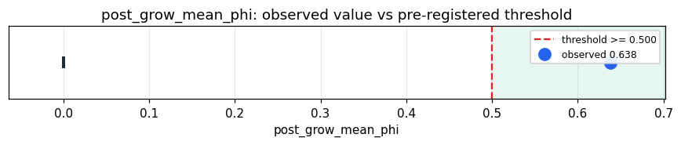

# Empirical Proof Record — **VALIDATED**

**Proof ID:** `c1c889feafde5139a20f0ecf7ca35f0f244dcf33716204d24271a5209eff7c05`  
**Created:** 2026-05-24T17:57:18.252037+00:00

## 1. Claim

> On the live substrate, growing the geoid dimension mid-session via _refit_geoid_dimension (re-fit on the substrate's own lived cloud, grow-only, N=IPR) keeps the cognitive cycle coherent — post-grow mean Φ >= 0.5 — where a naive dimension swap collapses it (Φ=0, stale Ymir + F2 drift). N grows with accumulated experience.

- **Operationalisation:** Learned-N Takwin at N=16 → warm-up cycles on real BGE words → _refit_geoid_dimension() (N=round IPR of the lived _geoid_map) → post-grow cycles; observed = post-grow mean Φ, gated on grew=True. (Measured in the Kimera venv; signed from the cache.)
- **Threshold:** `post_grow_mean_phi >= 0.5 phi`
- **H0:** H0: post-grow mean Φ < 0.5 or N did not grow — a live mid-session grow degrades cognition
- **H1:** H1: post-grow mean Φ >= 0.50 and N grew — runtime dynamic-N is viable

## 2. Verdict

**Outcome:** VALIDATED  
**Observed:** `0.638`

live mid-session grow N 16→71 (IPR 71.0, 152 geoids re-projected, grew=True); post-grow mean Φ 0.638 over 5 cycles (pre-grow 0.652); naive-swap baseline Φ=0 (stale Ymir + F2 drift; journals 077/079) — the method's resets keep the cycle coherent

## 3. Pre-registration

- Registered at: `2026-05-24T17:57:17.824255+00:00`
- Config hash: `c84c34eae94682a0f9c02e4bae6eaea4b7f508aa6099935f9aa0b174ac99b89d`
- Data hash: `8193bfba90344687c19a747691d10b4b43f3efa36ae8a3302fb8f6626491e2e2`

_Load the cached live measurement (dynamic_n_refit_cache_probe): N transition, IPR, pre/post-grow Φ; observed = post-grow mean Φ gated on N growing; contrast = the N transition + the naive-swap Φ=0 baseline._

## 4. Data

- Substrate: `kimera-swm` @ `8bd6c0c28657`
- Dataset: `os-dictionary-live-refit` (live substrate mid-session geoid-dimension grow on real BGE-encoded words (measured in-venv), 200 records, hash `8193bfba9034…`)

## 5. Evidence

| pillar | statistic | value | 95% CI | library |
|---|---|---|---|---|
| `runtime_dynamic_n_coherent` | `post_grow_mean_phi` | `0.638` | (0.0000, 0.0000) | numpy 2.4.4 |

## 6. Signature

`d95bd0ec980ebb2b09d1537a768be29ce565ccb62f0ef370754f5876e061383b`
