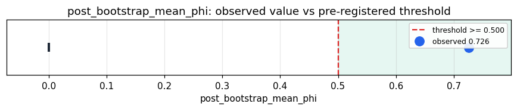

# Empirical Proof Record — **VALIDATED**

**Proof ID:** `31f3dced6479b557c45d8950f2fb2bbd2bfe8cba28348f89aef2e8219e095eba`  
**Created:** 2026-05-24T20:12:56.297179+00:00

## 1. Claim

> A default Takwin() with NO seed and no flags bootstraps its own learned geoid manifold from its OWN lived cloud at the first rich consolidation (cold N=5 → learned-N, no seed) and grows it as experience accumulates, with the cycle staying coherent (post-bootstrap mean Φ >= 0.5). Nothing is imposed; dynamic-N is mandatory and intrinsic.

- **Operationalisation:** Default Takwin() (cold N=5 hash, _use_learned_geoid=False) → stream of accumulating experience → _refit_geoid_dimension fires at consolidation, bootstrapping the first learned manifold from the lived _geoid_map cloud; observed = post-bootstrap mean Φ, gated on bootstrapped (cold→learned) AND N grew.
- **Threshold:** `post_bootstrap_mean_phi >= 0.5 phi`
- **H0:** H0: no cold-start bootstrap, or post-bootstrap Φ < 0.5 — seedless dynamic-N not viable
- **H1:** H1: bootstrapped from cold (no seed) and post-Φ >= 0.50 — nothing imposed

## 2. Verdict

**Outcome:** VALIDATED  
**Observed:** `0.7262`

cold start N=5 (learned=False); bootstrapped at cycle 4 → learned-N from the substrate's OWN cloud (no seed); grew to N=91 (4 grows); post-bootstrap mean Φ 0.726 (min 0.692) — coherent through the bootstrap. Nothing imposed; mandatory, intrinsic dynamic-N.

## 3. Pre-registration

- Registered at: `2026-05-24T20:12:56.034864+00:00`
- Config hash: `1cd54890719f7a2f7fbaeac678d009b3656b381e0712ebf2bcdf9021296c2172`
- Data hash: `e67f0113a391d32d01e13aa7538f497601260540c4dd1c2242412bde29fe6a3a`

_Load the cached seedless measurement (dynamic_n_seedless_cache_probe): N trajectory, bootstrap cycle, learned_geoid start/end, per-cycle Φ; observed = post-bootstrap mean Φ gated on a cold→learned bootstrap with N growth._

## 4. Data

- Substrate: `kimera-swm` @ `374e0cb207a9`
- Dataset: `default-substrate-seedless-bootstrap` (default substrate (no seed) bootstrapping its own geoid dimension from lived experience, 298 records, hash `e67f0113a391…`)

## 5. Evidence

| pillar | statistic | value | 95% CI | library |
|---|---|---|---|---|
| `seedless_self_dimensioning` | `post_bootstrap_mean_phi` | `0.7262` | (0.0000, 0.0000) | numpy 2.4.4 |

## 6. Signature

`be20a9321b358ce2da9900d80722d399f42bca6801271fcc3d13fbde3a3d302c`
