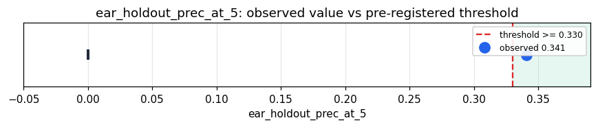

# Empirical Proof Record — **VALIDATED**

**Proof ID:** `5a9f1b5764d895f1fd3e8c9267c9ae30db7c1116e0f1c4b9abb364f90baaf1c2`  
**Created:** 2026-05-24T14:13:28.731836+00:00

## 1. Claim

> A learned-from-scratch ear gives a discriminating audio address on real ESC-50 sounds: held-out (source-disjoint fold 5) prec@5 >= 0.33, clearly beating raw log-mel (~0.227) and the live 5-stat encoder (~0.13 ≈ a random projection).

- **Operationalisation:** ESC-50 (50 classes × 2000 WAV); log-mel 64×128; a small from-scratch CNN ear (no pretrained weights) trained on folds 1-4; address = penultimate embedding; held-out fold-5 prec@5 (within−cross cosine NN), vs the 5-stat AudioGeoidEncoder and raw log-mel mean-pooled on the same fold.
- **Threshold:** `ear_holdout_prec_at_5 >= 0.33 precision@5`
- **H0:** H0: learned-ear prec@5 < 0.33 — a learned ear does not recover audio discrimination
- **H1:** H1: learned-ear prec@5 >= 0.33 — a faithful learned ear

## 2. Verdict

**Outcome:** VALIDATED  
**Observed:** `0.3405`

learned-ear held-out prec@5 0.3405 (margin 0.285) over 400 real clips, 50 classes (chance 0.020); 5-stat 0.1290 (margin 0.015 ≈ random); raw log-mel 0.2270

## 3. Pre-registration

- Registered at: `2026-05-24T14:13:28.481678+00:00`
- Config hash: `42661572305b7499123304ede00c46c3b5f668fd7f98819232cf55be89a4a5ef`
- Data hash: `0c75c5335aeeb189f84648dfee816cf517cb2f7b588def20d171ce574af85473`

_Load cached ESC-50 log-mel + learned-ear weights (folds 1-4); embed held-out fold 5; prec@5 for learned vs 5-stat vs raw log-mel; report the contrast._

## 4. Data

- Substrate: `kimera-swm` @ `78cb9f9fc6a8`
- Dataset: `esc50-real-audio` (real environmental-sound clips (held-out source-disjoint fold), 400 records, hash `0c75c5335aee…`)

## 5. Evidence

| pillar | statistic | value | 95% CI | library |
|---|---|---|---|---|
| `audio_address_discrimination` | `ear_holdout_prec_at_5` | `0.3405` | (0.0000, 0.0000) | numpy 2.4.4 |

## 6. Signature

`31970a88b946c9f96eda71ddbc5645a8015bf35cd351d140670336c64fee255e`
