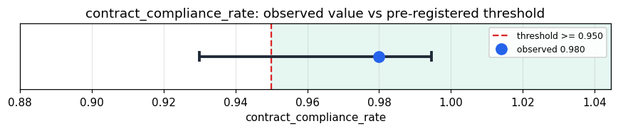

# Empirical Proof Record — **VALIDATED**

**Proof ID:** `3d35480a9e21fbc1df410fd09954efac24898b207390076f6d698a06e2353473`  
**Created:** 2026-05-21T21:55:10.873638+00:00

## 1. Claim

> Across every Python module in Kimera-SWM's interface stratum (REST routers + controllers, GraphQL surface, MCP tools, CLI commands, WebSocket handlers), at least 95% are structurally intact (parse cleanly AND declare at least one externally-callable handler).

- **Operationalisation:** contract_compliance_rate = (parses_ok AND (has_handler_def OR has_handler_decorator)) / total_interface_modules. ast.parse run on each module; decorators matched against a known handler-name allowlist (FastAPI verbs, Click commands, MCP tool/resource/prompt, etc.).
- **Threshold:** `contract_compliance_rate >= 0.95 proportion`
- **H0:** H0: structural breakage exceeds 5% — the interface contract is unstable at this Kimera commit
- **H1:** H1: structural breakage is ≤ 5% — the interface contract holds at this Kimera commit

## 2. Verdict

**Outcome:** VALIDATED  
**Observed:** `0.98`

98/100 interface-stratum modules are contract-compliant (0.9800); Wilson 95% CI [0.9300, 0.9945]

## 3. Pre-registration

- Registered at: `2026-05-21T21:55:10.654621+00:00`
- Config hash: `9f26daa05ad218678610e870509b45b26c8bd7436476a6d00a8ebe5d6eec64b2`
- Data hash: `1e6db2ddf6f79471767818149ece732610097e2cc528eb9322b3f4b48068fa8e`

_Run KimeraInventory.discover_interface against /Users/idirbenslama/Desktop/DEV/Kimera_SWM (Spherical Word Memory). For every Python module among the reported surfaces, parse with ``ast.parse`` and inspect top-level node types. Aggregate into contract_compliance_rate; decide against threshold ≥ 95.00% with a Wilson 95% CI._

## 4. Data

- Substrate: `kimera-swm` @ `674ae6b7b402`
- Dataset: `kimera-interface-stratum` (static-inventory, 100 records, hash `1e6db2ddf6f7…`)

## 5. Evidence

| pillar | statistic | value | 95% CI | library |
|---|---|---|---|---|
| `static_ast_parse` | `contract_compliance_rate` | `0.98` | (0.9300, 0.9945) | statsmodels 0.14.6 |

## 6. Signature

`def64c375cbe8c336602024da0e4a439529928555421ed2e3f0899acb1faa3e3`
