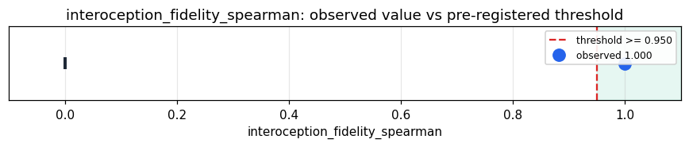

# Empirical Proof Record — **VALIDATED**

**Proof ID:** `83833a276bdbc9b8b8a4d28313f29a53dd558c9d5a1dc97caa878d70189d81e9`  
**Created:** 2026-05-24T13:53:39.006008+00:00

## 1. Claim

> Across up to 2000 real magnitudes in (0, 10000], the live internal-event chain with interoception ON (the door) emits a magnitude-ordered prime: Spearman(magnitude, p_thermo) >= 0.95, vs the legacy name-fingerprint (interoception OFF, ~0.47).

- **Operationalisation:** Distinct real FRED |values| within range drive the real static Takwin builders (_build_internal_event_payload_for_thermodynamic_transition / _spde_pressure_peak); each payload → real assign_from_internal_event → p_thermo from the registry, with _use_interoception True (door) and False (fingerprint); Spearman(magnitude, p_thermo) for both; distinctness.
- **Threshold:** `interoception_fidelity_spearman >= 0.95 rank-correlation`
- **H0:** H0: door Spearman < 0.95 — the live chain does not preserve the substrate's own magnitude
- **H1:** H1: door Spearman >= 0.95 — a faithful, ordered interoception

## 2. Verdict

**Outcome:** VALIDATED  
**Observed:** `0.9999985569996392`

door min-Spearman 1.0000 (per-builder {'thermodynamic_transition': 1.0, 'spde_pressure_peak': 1.0}) over 2000 real magnitudes [0.001, 9919.23]; fingerprint baseline mean 0.0143 {'thermodynamic_transition': 0.0121, 'spde_pressure_peak': 0.0164}

## 3. Pre-registration

- Registered at: `2026-05-24T13:53:38.734217+00:00`
- Config hash: `73b1f2c29112378fcaefb140db55af36159bfc482b3305bdedf3d6c33b6d631f`
- Data hash: `eb1b34b845d92d6ac0d1a662e72a9fd1b6e6c01ea01437e20a1008b48b2e74df`

_Drive real Takwin builders across real magnitudes; route each through real assign_from_internal_event with interoception ON and OFF; Spearman(magnitude, p_thermo) for both; report distinctness + the contrast._

## 4. Data

- Substrate: `kimera-swm` @ `78cb9f9fc6a8`
- Dataset: `fred-real-magnitudes` (real-macro magnitudes (|v|) within the interoception operating range, 2000 records, hash `eb1b34b845d9…`)

## 5. Evidence

| pillar | statistic | value | 95% CI | library |
|---|---|---|---|---|
| `interoception_magnitude_fidelity` | `interoception_fidelity_spearman` | `0.9999985569996392` | (0.0000, 0.0000) | numpy 2.4.4 |

## 6. Signature

`0e6cbc7d6b187a0bf08ce3f7849e1985736123ee120e022d77d78a7bb0f50f3c`
