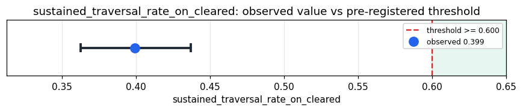

# Empirical Proof Record — **REFUTED**

**Proof ID:** `94e389abcd63c96c7336f14a39475fd23324f5b69de8a2837000a7bc1c15f577`  
**Created:** 2026-05-16T18:48:09.013495+00:00

## 1. Claim

> On real technical-domain text (Linux kernel commit messages) that clears Kimera's GWF, the substrate's walker reaches sustained traversal (halt_mode == 'exhausted') in >= 60% of cycles — i.e. the topology layer engages on technical reasoning instead of collapsing to amplitude_death.

- **Operationalisation:** fraction of GWF-cleared Linux-kernel-commit cycles for which result.halt_mode == 'exhausted'
- **Threshold:** `sustained_traversal_rate_on_cleared >= 0.6 fraction`
- **H0:** P(halt='exhausted' | gwf cleared) < 0.6
- **H1:** P(halt='exhausted' | gwf cleared) >= 0.6

## 2. Verdict

**Outcome:** REFUTED  
**Observed:** `0.39939485627836613`

walker reached sustained traversal in 264/661 GWF-cleared cycles (39.9%); amplitude_death in 188/661 (28.4%); GWF blocked 339/1000 (33.9%); halt modes observed: {'amplitude_death': 188, 'selective': 209, 'exhausted': 264}; dissonance median=28 (range 0-49); Φ median=0.209; 1000 cycles, 0 adapter errors

## 3. Pre-registration

- Registered at: `2026-05-16T18:15:03.535955+00:00`
- Config hash: `898ebda325a9dc57963638a7cf5ece8ce90824a72b13ed5d0a404fede9376ce4`
- Data hash: `92a34cc4275008279006eeec2c19cd2b45d7cc6167bf0d368d06fdcadf6a6648`

_Stream up to 1000 real Linux kernel commit messages (body length in [80, 4000] chars) through Kimera's entity target (Takwin), then measure the fraction of GWF-cleared cycles whose halt_mode is 'exhausted' (the substrate's sustained-traversal mode). Pre-registered threshold: >= 60%. Secondary descriptive evidence reports the full halt-mode distribution, dissonance-event distribution, GWF block rate, and Φ distribution — none post-hoc-claimable._

## 4. Data

- Substrate: `kimera-swm` @ `4552de7ee80c`
- Dataset: `linux-kernel-commits` (commit_corpus, 1445246 records, hash `92a34cc42750…`)

## 5. Evidence

| pillar | statistic | value | 95% CI | library |
|---|---|---|---|---|
| `O.topology.sustained_traversal` | `sustained_traversal_rate_on_cleared` | `0.39939485627836613` | (0.3627, 0.4372) | statsmodels 0.14.6 |
| `O.topology.amplitude_death_rate` | `amplitude_death_rate_on_cleared` | `0.2844175491679274` | — | ophamin 0.1.0 |
| `O.topology.halt_mode_distribution` | `halt_modes_observed_count` | `3.0` | — | ophamin 0.1.0 |
| `O.topology.gwf_block_rate` | `gwf_block_rate_on_linux` | `0.339` | — | ophamin 0.1.0 |
| `O.topology.dissonance_intensity` | `dissonance_events_count_median` | `28.0` | — | python-stdlib 3.14 |
| `O.topology.phi_distribution` | `phi_value_median` | `0.20932765306281081` | — | python-stdlib 3.14 |

## 6. Signature

`b35a591b2fb7ac9037dcaf04941f8f8f78b3f505c3197dc836186f08d4066a0a`
