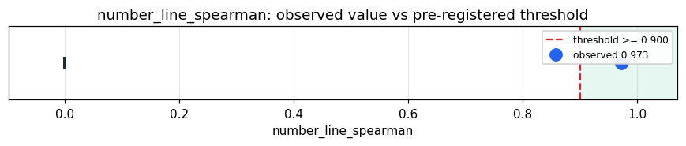

# Empirical Proof Record — **VALIDATED**

**Proof ID:** `34cbb086f141f87867ec67598990556035b469512ef4c2bd5a1b659a74e445f1`  
**Created:** 2026-05-24T03:38:21.622288+00:00

## 1. Claim

> Across up to 5000 real FRED numbers within ±1e+09, the live number sense emits a monotone number line: Spearman(value, p_thermo) >= 0.90.

- **Operationalisation:** Distinct real FRED values within range; live ArachneProtocol assign(str(v)) → p_thermo; Spearman(value, p_thermo); distinctness; neighbour-locality (adjacent-rank prime gap vs random-pair gap); zero → assign('0').p_thermo.
- **Threshold:** `number_line_spearman >= 0.9 rank-correlation`
- **H0:** H0: Spearman < 0.90 — the number sense does not preserve magnitude on real data
- **H1:** H1: Spearman >= 0.90 — a real magnitude number line

## 2. Verdict

**Outcome:** VALIDATED  
**Observed:** `0.9727888184955529`

Spearman 0.9728 over 5000 real numbers [-18.28, 3.40015e+07]; distinct 0.669; neighbour-locality adj/random 0.0162; zero→1409

## 3. Pre-registration

- Registered at: `2026-05-24T03:38:21.369634+00:00`
- Config hash: `c30e07444773f0cae97e751a946035ef604262389c166dfc9a7a84f1fed40a02`
- Data hash: `ea304b5707d0a4e1333352578cbd13de456a95a986284e80c803a4587afcebcc`

_Stream real FRED numbers within range through live assign(); Spearman(value, p_thermo); report distinctness, neighbour-locality, zero._

## 4. Data

- Substrate: `kimera-swm` @ `78cb9f9fc6a8`
- Dataset: `fred-real-numbers` (real-macro values within the number sense's operating range, 5000 records, hash `ea304b5707d0…`)

## 5. Evidence

| pillar | statistic | value | 95% CI | library |
|---|---|---|---|---|
| `magnitude_number_line` | `number_line_spearman` | `0.9727888184955529` | (0.0000, 0.0000) | numpy 2.4.4 |

## 6. Signature

`402a056c83ef33c6bf87afade626cb65fd3e40f11e1f474ca8f24d49ae07fdfd`
