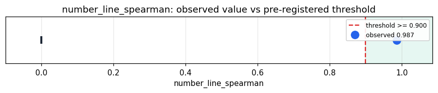

# Empirical Proof Record — **VALIDATED**

**Proof ID:** `b6a1a1cc2e4fad17fe8faa1a5053985fc09461c6b9b37d4de19a8be52f8458b2`  
**Created:** 2026-05-24T03:25:04.966996+00:00

## 1. Claim

> Across up to 4000 real FRED numbers within ±10000, the live number sense emits a monotone number line: Spearman(value, p_thermo) >= 0.90.

- **Operationalisation:** Distinct real FRED values within range; live ArachneProtocol assign(str(v)) → p_thermo; Spearman(value, p_thermo); distinctness; neighbour-locality (adjacent-rank prime gap vs random-pair gap); zero → assign('0').p_thermo.
- **Threshold:** `number_line_spearman >= 0.9 rank-correlation`
- **H0:** H0: Spearman < 0.90 — the number sense does not preserve magnitude on real data
- **H1:** H1: Spearman >= 0.90 — a real magnitude number line

## 2. Verdict

**Outcome:** VALIDATED  
**Observed:** `0.9866205326012835`

Spearman 0.9866 over 4000 real numbers [-18.28, 9953.75]; distinct 0.859; neighbour-locality adj/random 0.0216; zero→1409

## 3. Pre-registration

- Registered at: `2026-05-24T03:25:04.551146+00:00`
- Config hash: `0627a9d609c326ef3360bd0166fc94661ac6118c06d024bc050ed17fc5204944`
- Data hash: `cd357ab3435032f354d26ebe466929fe6b2812d86bd4dcc83565968b0951a92a`

_Stream real FRED numbers within range through live assign(); Spearman(value, p_thermo); report distinctness, neighbour-locality, zero._

## 4. Data

- Substrate: `kimera-swm` @ `78cb9f9fc6a8`
- Dataset: `fred-real-numbers` (real-macro values within the number sense's operating range, 4000 records, hash `cd357ab34350…`)

## 5. Evidence

| pillar | statistic | value | 95% CI | library |
|---|---|---|---|---|
| `magnitude_number_line` | `number_line_spearman` | `0.9866205326012835` | (0.0000, 0.0000) | numpy 2.4.4 |

## 6. Signature

`4148b5cfe2b58e4c9fd0c1d63980478bae3e23f4b0042ac234831918afc3afed`
