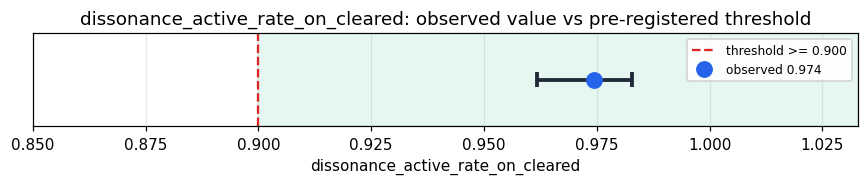

# Empirical Proof Record — **VALIDATED**

**Proof ID:** `b71961a6e5fb9b10b8c9a915806b1acc6a3208cd72d90bf74705e153d37405f0`  
**Created:** 2026-05-15T12:31:55.424266+00:00

## 1. Claim

> On routine organizational email that clears Kimera's GWF, the dissonance machinery fires (dissonance_events_count >= 1) in >= 90% of cycles (the architectural active-dissonance floor).

- **Operationalisation:** fraction of GWF-cleared Enron-email cycles for which raw['dissonance_events'] is a non-empty list
- **Threshold:** `dissonance_active_rate_on_cleared >= 0.9 fraction`
- **H0:** P(dissonance fires | gwf cleared) < 0.9
- **H1:** P(dissonance fires | gwf cleared) >= 0.9

## 2. Verdict

**Outcome:** VALIDATED  
**Observed:** `0.9743875278396437`

dissonance fired in 875/898 GWF-cleared cycles (97.4%); GWF blocked 102/1000 (10.2%); manipulation_detected in 3/1000 (0.3%); dissonance_events median=21 (range 0-57); 1000 cycles, 0 adapter errors

## 3. Pre-registration

- Registered at: `2026-05-15T11:51:54.333166+00:00`
- Config hash: `634a7fa908610f797105b46eb48c7819fdd19f7a83ad7d94fe6e2dd0e5b1b761`
- Data hash: `b3da1b3fe0369ec3140bb4fbce94702c33b7da810ec15d718b3fadf5cd748ca7`

_Stream up to 1000 real Enron emails (body length in [100, 4000] chars) through Kimera's entity target (Takwin), then measure the fraction of GWF-cleared cycles for which the dissonance machinery fired (dissonance_events_count >= 1). Pre-registered threshold: >= 90%. Secondary descriptive evidence reports the distribution of dissonance_events_count and productive_dissonance_score, the GWF block rate on Enron, and the manipulation_detector rate — none post-hoc-claimable._

## 4. Data

- Substrate: `kimera-swm` @ `83d4655bcf30`
- Dataset: `enron-email-corpus` (email_corpus, 517401 records, hash `b3da1b3fe036…`)

## 5. Evidence

| pillar | statistic | value | 95% CI | library |
|---|---|---|---|---|
| `O.dissonance.active_on_cleared` | `dissonance_active_rate_on_cleared` | `0.9743875278396437` | (0.9619, 0.9829) | statsmodels 0.14.6 |
| `O.dissonance.intensity_distribution` | `dissonance_events_count_median` | `21.0` | — | python-stdlib 3.14 |
| `O.dissonance.productive_score` | `productive_dissonance_score_median` | `0.56` | — | python-stdlib 3.14 |
| `O.organizational.gwf_block_rate` | `gwf_block_rate_on_enron` | `0.102` | — | ophamin 0.1.0 |
| `O.organizational.manipulation_rate` | `manipulation_detected_rate_on_enron` | `0.003` | — | ophamin 0.1.0 |

## 6. Signature

`dd1c7ba87b8f2a065975e3b517df596f205a869a302f8555d11278325f5a318b`
