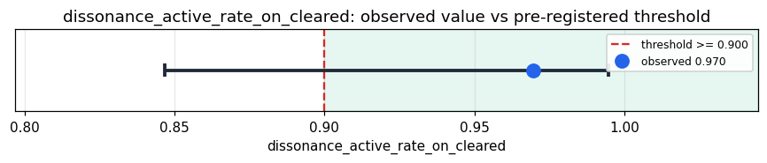

# Empirical Proof Record — **VALIDATED**

**Proof ID:** `125e5b936dc0414d6d4d131e39046ae6e341579d5921719bf75257a0f15cbf8c`  
**Created:** 2026-05-24T03:31:22.756536+00:00

## 1. Claim

> On routine organizational email that clears Kimera's GWF, the dissonance machinery fires (dissonance_events_count >= 1) in >= 90% of cycles (the architectural active-dissonance floor).

- **Operationalisation:** fraction of GWF-cleared Enron-email cycles for which raw['dissonance_events'] is a non-empty list
- **Threshold:** `dissonance_active_rate_on_cleared >= 0.9 fraction`
- **H0:** P(dissonance fires | gwf cleared) < 0.9
- **H1:** P(dissonance fires | gwf cleared) >= 0.9

## 2. Verdict

**Outcome:** VALIDATED  
**Observed:** `0.9696969696969697`

dissonance fired in 32/33 GWF-cleared cycles (97.0%); GWF blocked 7/40 (17.5%); manipulation_detected in 0/40 (0.0%); dissonance_events median=11 (range 0-45); 40 cycles, 0 adapter errors

## 3. Pre-registration

- Registered at: `2026-05-24T03:29:10.538516+00:00`
- Config hash: `5c47a0239c88e8882d03417943db4abe05f799f7d98ba5883102579bcbbf51f3`
- Data hash: `b3da1b3fe0369ec3140bb4fbce94702c33b7da810ec15d718b3fadf5cd748ca7`

_Stream up to 40 real Enron emails (body length in [100, 4000] chars) through Kimera's entity target (Takwin), then measure the fraction of GWF-cleared cycles for which the dissonance machinery fired (dissonance_events_count >= 1). Pre-registered threshold: >= 90%. Secondary descriptive evidence reports the distribution of dissonance_events_count and productive_dissonance_score, the GWF block rate on Enron, and the manipulation_detector rate — none post-hoc-claimable._

## 4. Data

- Substrate: `kimera-swm` @ `78cb9f9fc6a8`
- Dataset: `enron-email-corpus` (email_corpus, 517401 records, hash `b3da1b3fe036…`)

## 5. Evidence

| pillar | statistic | value | 95% CI | library |
|---|---|---|---|---|
| `O.dissonance.active_on_cleared` | `dissonance_active_rate_on_cleared` | `0.9696969696969697` | (0.8468, 0.9946) | statsmodels 0.14.6 |
| `O.dissonance.intensity_distribution` | `dissonance_events_count_median` | `11.0` | — | python-stdlib 3.14 |
| `O.dissonance.productive_score` | `productive_dissonance_score_median` | `0.2258` | — | python-stdlib 3.14 |
| `O.organizational.gwf_block_rate` | `gwf_block_rate_on_enron` | `0.175` | — | ophamin 0.1.0 |
| `O.organizational.manipulation_rate` | `manipulation_detected_rate_on_enron` | `0.0` | — | ophamin 0.1.0 |

## 6. Signature

`7bf0b296962ab2b64b9e6c13a5c188b5eb179c36612ed118ca20bc065f3aeea7`
