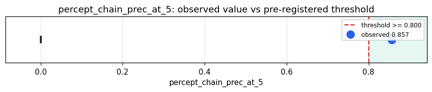

# Empirical Proof Record — **VALIDATED**

**Proof ID:** `e480e88ad24b6524c657d78882f16954d69b7763291842b655e0f9fbcaf6399e`  
**Created:** 2026-05-24T15:05:31.481645+00:00

## 1. Claim

> The faithful percept door (cosine-LSH → prime chain, assign_from_percept) preserves a learned sense's discrimination into prime space: deposited-chain prec@5 >= 0.80 on real held-out Heimdall/CIFAR addresses, near the address ceiling and far above the web-feel readout (~0.36).

- **Operationalisation:** Cached real Heimdall addresses for held-out CIFAR → live ArachneProtocol.assign_from_percept → the deposited prime chain (from the unified registry's chain index); prec@5 via bag-of-primes cosine, vs the address's own cosine prec@5 (the ceiling).
- **Threshold:** `percept_chain_prec_at_5 >= 0.8 precision@5`
- **H0:** H0: chain prec@5 < 0.80 — the door collapses the percept entering prime space
- **H1:** H1: chain prec@5 >= 0.80 — a faithful percept door

## 2. Verdict

**Outcome:** VALIDATED  
**Observed:** `0.8569444444444444`

deposited-chain prec@5 0.8569 over 144 real Heimdall addresses (6 classes, chance 0.167); address ceiling 0.9056; retention 0.95 (vs the web-feel readout ~0.40)

## 3. Pre-registration

- Registered at: `2026-05-24T15:05:31.181356+00:00`
- Config hash: `2c52a3f63ef69fc57177a1cf25e77e1e18a7ba89cf1ebda3727ff916d7c3a0b3`
- Data hash: `c572f4b93ddcdf545582a18c5264270e98826d2f415736ae29619810bc420ba3`

_Load cached Heimdall addresses; run live assign_from_percept; read the deposited chains; chain prec@5 vs address prec@5; report retention._

## 4. Data

- Substrate: `kimera-swm` @ `78cb9f9fc6a8`
- Dataset: `heimdall-cifar-addresses` (real learned-sense (Heimdall) addresses for held-out CIFAR images, 144 records, hash `c572f4b93ddc…`)

## 5. Evidence

| pillar | statistic | value | 95% CI | library |
|---|---|---|---|---|
| `percept_prime_discrimination` | `percept_chain_prec_at_5` | `0.8569444444444444` | (0.0000, 0.0000) | numpy 2.4.4 |

## 6. Signature

`954e7fe41c6dbd08881c50069b7c65d08156ee14b6018c5e582b3ced71283a9e`
