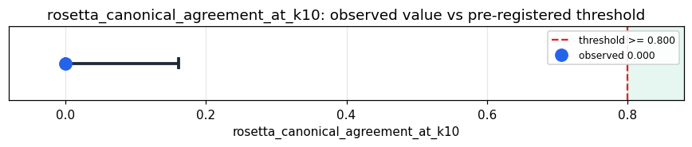

# Empirical Proof Record — **REFUTED**

**Proof ID:** `12e97ceb0f762964b6a667bc2512db628c86d1db8769595bd1dace35310b979a`  
**Created:** 2026-05-15T11:42:19.202367+00:00

## 1. Claim

> On sentence-aligned parallel text, Kimera's Rosetta layer maps the same sentence content to the same canonical address in >= 80% of sentence groups when 10 languages are sampled per group (the universal-semantic-address promise).

- **Operationalisation:** fraction of FLORES-200 sentence groups for which Kimera's Rosetta returns a single distinct canonical value across 10 randomly-sampled language translations of the same sentence
- **Threshold:** `rosetta_canonical_agreement_at_k10 >= 0.8 fraction`
- **H0:** canonical agreement at K=10 < 0.8
- **H1:** canonical agreement at K=10 >= 0.8

## 2. Verdict

**Outcome:** REFUTED  
**Observed:** `0.0`

Rosetta canonical agreement at K=10: 0/20 groups all-agree (0.0%); prime agreement at K=10: 0/20 (0.0%); 1000 cycles, 0 adapter errors

## 3. Pre-registration

- Registered at: `2026-05-15T11:42:10.452568+00:00`
- Config hash: `5a35c1f0d77c80f222103d23086c3730aa6de5b0959de4f1482e19556b638baa`
- Data hash: `bf4196403365897ad95dbcc18fc5116a99bc007f58e71dd302566b61b4296262`

_Stream up to 1000 single-language translations from FLORES-200 (50 languages per sentence group, deterministically sampled with seed=0) through Kimera's Rosetta 'rosetta' target, then per sentence group compute whether all K translations collapsed to the same Rosetta canonical address. Report agreement rates at K in [3, 5, 10, 20, 50]; the pre-registered threshold sits at K=10 (>= 80%)._

## 4. Data

- Substrate: `kimera-swm` @ `1dc88186691c`
- Dataset: `flores-200` (parallel_corpus, 997 records, hash `bf4196403365…`)

## 5. Evidence

| pillar | statistic | value | 95% CI | library |
|---|---|---|---|---|
| `O.rosetta.canonical_agreement` | `rosetta_canonical_agreement_at_k10` | `0.0` | (0.0000, 0.1611) | statsmodels 0.14.6 |
| `O.rosetta.prime_agreement` | `rosetta_prime_agreement_at_k10` | `0.0` | (0.0000, 0.1611) | statsmodels 0.14.6 |

## 6. Signature

`ef32842d9e94b91eefe0b52cb993d2bdc74324d0b0852c0c69bcaf09affce56e`
