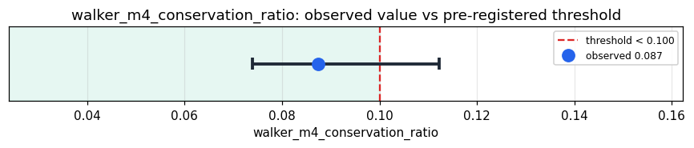

# Empirical Proof Record — **VALIDATED**

**Proof ID:** `1bc36bbeb4b5c33785a90a4d6c669cf87c8d7119fd9c354439d3eea3efd6b43a`  
**Created:** 2026-05-17T16:40:40.864594+00:00

## 1. Claim

> For Walker M4 events (substrate decision-points: `halt_reason == 'lateral_leap'` OR `walker_annealing_events > 0`) in a Family J Takwin trajectory, the three-term conservation ratio R = median|Δ(P+T+CW_seed)| / median|P+T+CW_seed| is < 0.10. The Phase 137 SEED of scar_coherence_weight (`0.5 + 0.5 · _prior_trajectory_coherence`, before Phases 148-182 modulations) is the substrate's clean linear compensator at decision-points. Pressure and tension are averages over named proxy fields per the Sinew Phase 0 inventory (5 pressure + 5 tension); CW_seed is the legacy `scar_coherence_weight` field on OrchestratorResult. All inputs std-normalized before summing.

- **Operationalisation:** Auto-detect Walker M4 events per cycle from the trajectory's events dict (lateral_leap halt OR walker_annealing_events > 0). For each event at index i > 0, compute residual = total(i-1) − total(i) where total = norm(P_avg) + norm(T_avg) + norm(CW_seed). Headline metric = median|residual| / median|total|. Bootstrap 95% CI from 2000 resamples. Verdict on R < threshold. Secondary characterizations: ouroboros + scar conservation ratios + scar magnitude quartile leak structure.
- **Threshold:** `walker_m4_conservation_ratio < 0.1 dimensionless`
- **H0:** walker_m4_conservation_ratio >= 0.10 — the substrate does not obey (P+T+CW_seed) conservation at decision-points; Sinew Phase 4-extended STRONG_PASS regressed; substrate decision-points fail to compensate stress redistribution within the three-term accounting
- **H1:** walker_m4_conservation_ratio < 0.10 — substrate decision-points conserve stress at the STRONG threshold; the Phase 137 SEED is doing genuine compensatory work; Sinew Phase 4-extended finding validated at this commit

## 2. Verdict

**Outcome:** VALIDATED  
**Observed:** `0.08734077535187149`

Conservation analysis (500 cycles, 105 walker_m4 events / 35 ouroboros / 465 scar): walker_m4 R=0.0873 [CI 0.0739, 0.1123]; ouroboros R=0.1163; scar R=0.1048. Scar Q4-leak structure: Q1_smallest=0.0590, Q2=0.0797, Q3=0.1147, Q4_largest=0.2067.

## 3. Pre-registration

- Registered at: `2026-05-17T16:40:40.658479+00:00`
- Config hash: `9dd6ebb8fde1dec769b834e74bfc353f9c6e76a66f860af54f469e57a4e0c121`
- Data hash: `6f7dbd3b70e63ebf77f930d98f0d566d453078c980d43a8a8d3d418ab83b3b7b`

_Read captured Kimera trajectory (Sinew Phase 4-extended shape — per-cycle records with pressure_proxies + tension_proxies + scar.scar_coherence_weight + events). Auto-detect Walker M4 / Ouroboros / scar events. Compute three-term conservation ratio at each event class. Bootstrap 95% CI from 2000 resamples. Verdict on walker_m4_conservation_ratio < 0.1. Secondary characterizations: ouroboros + scar ratios + scar magnitude quartile leak structure._

## 4. Data

- Substrate: `kimera-swm` @ `4552de7ee80c`
- Dataset: `kimera-sinew-trajectory` (takwin-sinew-extended-trajectory, 500 records, hash `6f7dbd3b70e6…`)

## 5. Evidence

| pillar | statistic | value | 95% CI | library |
|---|---|---|---|---|
| `sinew_conservation` | `walker_m4_conservation_ratio` | `0.08734077535187149` | (0.0739, 0.1123) | ophamin.measuring.scenarios.sinew_conservation 0.8.5 |

## 6. Signature

`16ed28c491801a914cc628c62638ea2348b8de4dc96057ff58a3ad50c8d009f0`
