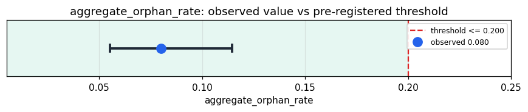

# Empirical Proof Record — **VALIDATED**

**Proof ID:** `60914772e4dc3962001501ed3bb8b0a8072a4e70be1ccb6cdf30ca22e24ccb4f`  
**Created:** 2026-05-21T21:53:24.985176+00:00

## 1. Claim

> Across all 9 KimeraInventory strata, the aggregate orphan rate is ≤ 20.0%. An orphan is a Python module in the inventory that has zero incoming imports from any other file in the Kimera repo AND is not explicitly annotated as WIRE_CANDIDATE / WIRED / ARCHIVED.

- **Operationalisation:** Build an import graph by walking every .py file under kimera_swm/ and parsing ``import`` / ``from ... import`` statements. For each inventoried surface, count incoming edges. Combine with annotation scanning (``.. note:: WIRE_CANDIDATE`` etc.) to produce one of {wired, wire_candidate, orphan, archived, parse_error, config}. orphan_rate = n_orphan / n_total_python_surfaces.
- **Threshold:** `aggregate_orphan_rate <= 0.2 proportion`
- **H0:** H0: orphan rate > 20.0% — load-bearing infrastructure is sitting unwired; fix list is non-empty
- **H1:** H1: orphan rate ≤ 20.0% — substrate completeness within target band

## 2. Verdict

**Outcome:** VALIDATED  
**Observed:** `0.08`

26/325 surfaces classified orphan (0.0800); Wilson 95% CI [0.0552, 0.1146]

## 3. Pre-registration

- Registered at: `2026-05-21T21:53:24.638778+00:00`
- Config hash: `c0fd9cc53c786b0fb80f5ca5cab5c6f30ce671d494ebea10832ed9cbd1e42c88`
- Data hash: `76543e1c4be6bcde01d8c66ab84d6245155ed9225991d5d810ce89b878fa4b9f`

_Run KimeraInventory.discover_all against /Users/idirbenslama/Desktop/DEV/Kimera_SWM (Spherical Word Memory), then build a repo-wide import graph and classify each surface per the operationalization. Aggregate orphan_rate across all strata; decide against threshold ≤ 20.00%. Wilson 95% CI on the proportion. Per-stratum breakdown and the orphan / WIRE_CANDIDATE action lists are in the proof evidence._

## 4. Data

- Substrate: `kimera-swm` @ `674ae6b7b402`
- Dataset: `kimera-substrate-completeness-probe` (static-inventory+import-graph, 325 records, hash `76543e1c4be6…`)

## 5. Evidence

| pillar | statistic | value | 95% CI | library |
|---|---|---|---|---|
| `import_graph_static` | `aggregate_orphan_rate` | `0.08` | (0.0552, 0.1146) | statsmodels 0.14.6 |

## 6. Signature

`8f37647d5187132c99a5a15e57f16aa806362a4696aff0e0e6780bc8cd5542b7`
