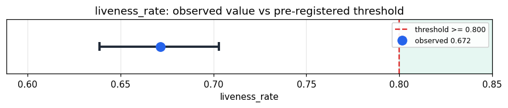

# Empirical Proof Record — **REFUTED**

**Proof ID:** `232db71cba37509efbef3d2de9938c08a6a89c9a0cee165d5de06622093c78fc`  
**Created:** 2026-05-23T20:32:21.688210+00:00

## 1. Claim

> At least 80% of the always-on numeric signals Kimera emits (those present in EVERY cycle) carry real dynamics (vary with the stimulus) rather than emitting a frozen default constant.

- **Operationalisation:** Stream 64 diverse records from the 'flores' corpus through the Kimera 'entity' target; collect every finite numeric leaf in CycleResult.raw per cycle. Restrict to ALWAYS-ON signals (present in all cycles → zero sampling doubt); a signal is LIVE if it takes >= 2 distinct values, FROZEN if constant. liveness_rate = always_on_live / always_on_total. Under-sampled signals are excluded (a signal seen in few cycles is trivially constant — not a frozen default).
- **Threshold:** `liveness_rate >= 0.8 proportion`
- **H0:** H0: liveness < 80% — most emitted signals are frozen defaults; the body is structurally wired but not dynamically alive; the frozen worklist is non-empty
- **H1:** H1: liveness >= 80% — the emitted signal surface is dynamically alive

## 2. Verdict

**Outcome:** REFUTED  
**Observed:** `0.6715506715506715`

always-on liveness 0.6716: 550/819 every-cycle signals carry real dynamics; 269 are frozen defaults (the worklist); Wilson 95% CI [0.6387, 0.7028]. Context: whole-surface 3311/15754 (0.2102, deflated by under-sampling); 64 cycles

## 3. Pre-registration

- Registered at: `2026-05-23T20:30:07.782503+00:00`
- Config hash: `e683f31a2ae22e752e0db448f4a3059407edee45e64a148af8fd44713cfb157b`
- Data hash: `bf4196403365897ad95dbcc18fc5116a99bc007f58e71dd302566b61b4296262`

_Stream 64 diverse 'flores' records through the Kimera 'entity' target; flatten all numeric leaves in CycleResult.raw per cycle; classify each signal live (>=2 distinct values) vs frozen (constant). Decide liveness_rate against threshold >= 80%. Wilson 95% CI on the proportion. The frozen-signal worklist (by organ) is in the proof evidence._

## 4. Data

- Substrate: `kimera-swm` @ `78cb9f9fc6a8`
- Dataset: `flores-200` (parallel_corpus, 997 records, hash `bf4196403365…`)

## 5. Evidence

| pillar | statistic | value | 95% CI | library |
|---|---|---|---|---|
| `signal_dynamics` | `liveness_rate` | `0.6715506715506715` | (0.6387, 0.7028) | statsmodels 0.14.6 |

## 6. Signature

`858764d965bfaaadf36377a56493caf88825d3712cdacd629a6dbefa049ab8e9`
