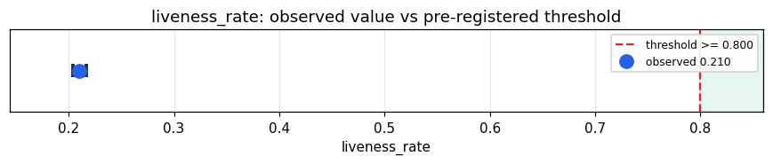

# Empirical Proof Record — **REFUTED**

**Proof ID:** `442851af8e217b9b56ae723d7d53b5de5c8e2264e0d1205fced17daaf9beeb99`  
**Created:** 2026-05-23T20:28:02.507403+00:00

## 1. Claim

> At least 80% of the numeric signals Kimera emits during real-corpus cycles carry real dynamics (vary with the stimulus) rather than emitting a frozen default constant.

- **Operationalisation:** Stream 64 diverse records from the 'flores' corpus through the Kimera 'entity' target; collect every finite numeric leaf in CycleResult.raw across cycles. A signal is LIVE if it takes >= 2 distinct values across the cycles it appears in, FROZEN if constant. liveness_rate = n_live / n_numeric_signals_total.
- **Threshold:** `liveness_rate >= 0.8 proportion`
- **H0:** H0: liveness < 80% — most emitted signals are frozen defaults; the body is structurally wired but not dynamically alive; the frozen worklist is non-empty
- **H1:** H1: liveness >= 80% — the emitted signal surface is dynamically alive

## 2. Verdict

**Outcome:** REFUTED  
**Observed:** `0.20997841817950996`

3308/15754 numeric signals carry real dynamics (liveness 0.2100); always-on liveness 0.6728 (551/819); 12446 frozen; Wilson 95% CI [0.2037, 0.2164]; 64 cycles

## 3. Pre-registration

- Registered at: `2026-05-23T20:25:46.409158+00:00`
- Config hash: `e683f31a2ae22e752e0db448f4a3059407edee45e64a148af8fd44713cfb157b`
- Data hash: `bf4196403365897ad95dbcc18fc5116a99bc007f58e71dd302566b61b4296262`

_Stream 64 diverse 'flores' records through the Kimera 'entity' target; flatten all numeric leaves in CycleResult.raw per cycle; classify each signal live (>=2 distinct values) vs frozen (constant). Decide liveness_rate against threshold >= 80%. Wilson 95% CI on the proportion. The frozen-signal worklist (by organ) is in the proof evidence._

## 4. Data

- Substrate: `kimera-swm` @ `78cb9f9fc6a8`
- Dataset: `flores-200` (parallel_corpus, 997 records, hash `bf4196403365…`)

## 5. Evidence

| pillar | statistic | value | 95% CI | library |
|---|---|---|---|---|
| `signal_dynamics` | `liveness_rate` | `0.20997841817950996` | (0.2037, 0.2164) | statsmodels 0.14.6 |

## 6. Signature

`aaab13c01d8670bdeccae925d0085e112f83cbf99ea1efa3436cfcb19b36fa8c`
