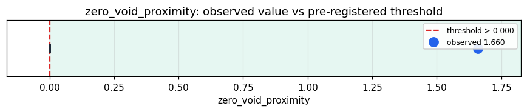

# Empirical Proof Record — **VALIDATED**

**Proof ID:** `2efaa20df147d23985c7645a79543c668cf715dce44c27ae6dc3eb6f9653b464`  
**Created:** 2026-05-24T02:56:48.978312+00:00

## 1. Claim

> The substrate's response to the number ZERO collocates with its VOID/collapse state (contradiction stimuli) more than with idle rest (neutral stimuli): zero_void_proximity > 0.

- **Operationalisation:** Stream four stimulus conditions (neutral, zero, numbers, contradiction) through the full entity cycle; per condition, take the mean over cycles of the substrate's void-class (void/null/contradiction/collapse/dissonance) and entropy-class (entropy/varentropy/uncertainty) raw fields; z-normalise across conditions; zero_void_proximity = dist(zero, neutral) − dist(zero, contradiction).
- **Threshold:** `zero_void_proximity > 0.0 z-distance`
- **H0:** H0: zero sits nearer rest than the void (proximity <= 0) — zero is absence
- **H1:** H1: zero sits nearer the void than rest (proximity > 0) — zero is the void

## 2. Verdict

**Outcome:** VALIDATED  
**Observed:** `1.6599392571775624`

zero_void_proximity +1.660 (dist(zero,rest)=9.999, dist(zero,void)=8.339); void-real dist(void,rest)=8.718; plenum entropy(void)/entropy(rest)=1.168; 50 void/entropy fields

## 3. Pre-registration

- Registered at: `2026-05-24T02:56:48.289467+00:00`
- Config hash: `adc55152c7c9ad3cbb55167674030259202b54a6eb080a86382849389a06102a`
- Data hash: `8e4cb8d2cf9747c5d252c5d7532fe1348700c94310ad18ffcc3bd0bf62110b14`

_Per condition: stream stimuli, flatten CycleResult.raw, keep void+entropy fields, average over cycles. z-normalise the 4 signature vectors; report zero_void_proximity = dist(zero,neutral) − dist(zero,contradiction); secondary: dist(contradiction,neutral) (void real?) and entropy(contradiction)/entropy(neutral) (plenum?)._

## 4. Data

- Substrate: `kimera-swm` @ `78cb9f9fc6a8`
- Dataset: `zero-void-conditions` (ontology-probe (neutral/zero/numbers/contradiction), 32 records, hash `8e4cb8d2cf97…`)

## 5. Evidence

| pillar | statistic | value | 95% CI | library |
|---|---|---|---|---|
| `zero_as_void` | `zero_void_proximity` | `1.6599392571775624` | (0.0000, 0.0000) | numpy 2.4.4 |

## 6. Signature

`85ee1588e8a70f678118358e73de9cd36a2c2b1c5607815d08bd61bb5557c78d`
